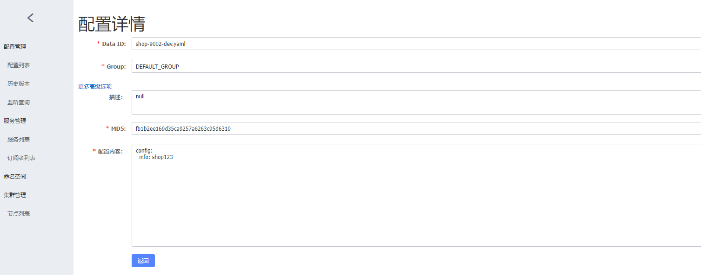
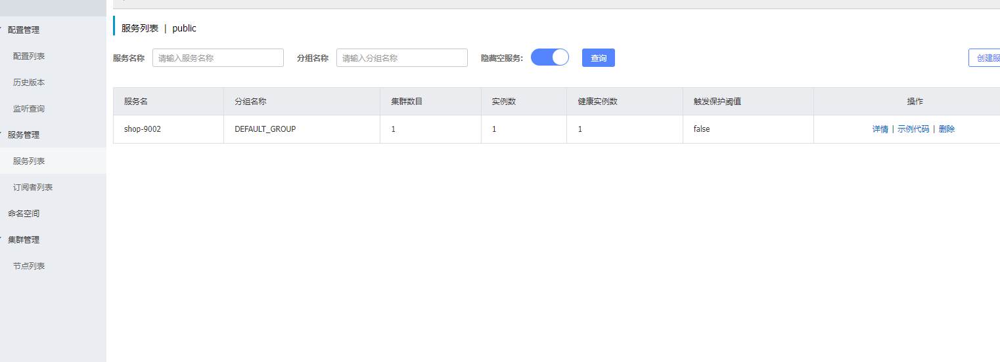
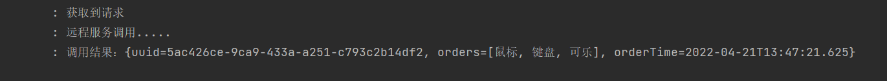
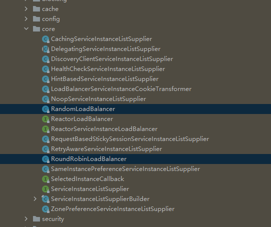

SpringCloudAlibaba

# 项目结构

一个父工程 **springcloud-alibaba**

三个微服务 **shop user oder**

使用**nacos**作为配置中心和注册中心

使用**openfiegn**作为声明式服务调用

# 版本与相关依赖


| spring cloud | spring cloud alibaba | springboot |
| -------------- | ---------------------- | ------------ |
| 2020.0.4     | 2021.1               | 2.5.6      |

父工程相关依赖

```xml
            <!--Spring Cloud Alibaba 的版本信息-->
            <dependency>
                <groupId>com.alibaba.cloud</groupId>
                <artifactId>spring-cloud-alibaba-dependencies</artifactId>
                <version>2021.1</version>
                <type>pom</type>
                <scope>import</scope>
            </dependency>
            <!--Spring Cloud 的版本信息-->
            <dependency>
                <groupId>org.springframework.cloud</groupId>
                <artifactId>spring-cloud-dependencies</artifactId>
                <version>2020.0.4</version>
                <type>pom</type>
                <scope>import</scope>
            </dependency>
```

# Nacos组件使用

[github里选择合适的版本](https://) 下载并解压，双击bin目录下的startup.cmd即可 在浏览器输入 localhost:8848/nacos 即可进入web页面 登录账户密码都是nacos

## 1.配置中心

新建modul取名shop-9002,引入springboot-web相关依赖，准备一个接口用来获取配置中心的某个值

* 加入配置中心相关依赖

```xml
<dependency>
    <groupId>com.alibaba.cloud</groupId>
    <artifactId>spring-cloud-starter-alibaba-nacos-config</artifactId>
</dependency>
```

* 配置

在resource资源文件夹下新建bootstrap.yml文件，文件内指定服务名和nacos配置中心地址

```yaml
server:
  port: 9002 #端口号
spring:
  application:
    name: shop-9002 #服务名
  cloud:
    nacos:
  
      config:
        server-addr: 127.0.0.1:8848 #Nacos作为配置中心地址
        file-extension: yaml #指定yaml格式的配置
```

继续新建application.yml文件 用来指定当前profile.active

```yaml
spring:
  profiles:
    active: dev
```

进入nacos管理页面，在配置列表中新建配置



其中DataID的格式为\${prefix}-\${spring.profiles.active}.${file-extension}

* ${prefix}：默认取值为微服务的服务名，即配置文件中 spring.application.name 的值，可以在配置文件中通过配置 spring.cloud.nacos.config.prefix 来指定。
* \${spring.profiles.active}：表示当前环境对应的 Profile，例如 dev、test、prod 等。当没有指定环境的 Profile 时，其对应的连接符也将不存在， dataId 的格式变成 \${prefix}.${file-extension}。
* ${file-extension}：表示配置内容的数据格式，我们可以在配置文件中通过配置项 spring.cloud.nacos.config.file-extension 来配置，例如 properties 和 yaml。

还需要加入如下依赖才能让项目正确启动

```xml
<!--SpringCloud2020及以后的版本默认不启用 bootstrap 配置，我们需要在pom里面显式地引入：-->
<dependency>
    <groupId>org.springframework.cloud</groupId>
    <artifactId>spring-cloud-starter-bootstrap</artifactId>
</dependency>
```

启动之后访问接口http://localhost:9002/api/shop/serverName 即可获取到在配置中心配置的参数

## 2.服务注册

* 引入依赖

```xml
<dependency>
    <groupId>com.alibaba.cloud</groupId>
    <artifactId>spring-cloud-starter-alibaba-nacos-discovery</artifactId>
</dependency>
```

* 配置文件配置注册中心地址

  ```yaml
  spring:
    application:
      name: shop-9002 #服务名
    cloud:
      nacos:
        discovery:
          server-addr: 127.0.0.1:8848 #Nacos服务注册中心地址
  ```
* 在启动类加上注解@EnableDiscoveryClient

  ```java
  @SpringBootApplication
  @EnableDiscoveryClient
  public class ShopApplication {
      public static void main(String[] args) {
          SpringApplication.run(ShopApplication.class,args);
      }
  }
  ```

直接启动项目，在nacos管理页面点击服务列表就可以看到该服务



# OpenFeign组件使用

## 1.概念

**OpenFeign **全称 Spring Cloud OpenFeign，它是 Spring 官方推出的一种声明式服务调用与负载均衡组件，它的出现就是为了替代进入停更维护状态的 Feign。相当于结合了**RestTemplate**和**Ribbon**，使用该组件可以让服务之间的远程调用写法变为同一个服务的本地方法调用写法

## 2.用法

* 引入依赖

在需要进行远程调用的服务中引入

```xml
        <dependency>
            <groupId>org.springframework.cloud</groupId>
            <artifactId>spring-cloud-starter-openfeign</artifactId>
        </dependency>

        <dependency>
            <groupId>org.springframework.cloud</groupId>
            <artifactId>spring-cloud-starter-loadbalancer</artifactId>
        </dependency>
```

同时：

1. nacos 2021 版本已经没有自带ribbon的整合，所以需要引入另一个支持的jar包 loadbalancer
2. nacos 2021 版本已经取消了对ribbon的支持，所以无法通过修改Ribbon负载均衡的模式来实现nacos提供的负载均衡模式

所以需要修改pom文件

```xml
<!--排除掉ribbon--> 
<dependency>
            <groupId>com.alibaba.cloud</groupId>
            <artifactId>spring-cloud-starter-alibaba-nacos-discovery</artifactId>
            <exclusions>
                <exclusion>
                    <groupId>org.springframework.cloud</groupId>
                    <artifactId>spring-cloud-starter-netflix-ribbon</artifactId>
                </exclusion>
            </exclusions>
</dependency>
<!--加入loadbalancer-->
<dependency>
            <groupId>org.springframework.cloud</groupId>
            <artifactId>spring-cloud-starter-loadbalancer</artifactId>
</dependency>
```

启动类添加@EnableFeignClients注解

```java
@SpringBootApplication
@EnableDiscoveryClient
@EnableFeignClients
public class ShopApplication {
    public static void main(String[] args) {
        SpringApplication.run(ShopApplication.class,args);
    }
}
```

然后新建一个服务接口，在接口上添加@FeignClient(name = "order-9001")注解，name在注册中心注册的服务名，在接口方法使用@GetMapping("api/order/getOrder")，其中参数表示接口，方法名尽量和调用接口的方法名一样，通过spring注入之后就可以像单体项目一样进行调用了，非常方便！

```java
@FeignClient(name = "order-9001")
public interface OrderFeignService {
    @GetMapping("api/order/getOrder")
    CommonResult getOrder();

}
```

```java
    @Autowired
    private OrderFeignService orderFeignService;

    @GetMapping("shop")
    public CommonResult shop() {
        log.info("获取到请求");

        log.info("远程服务调用.....");
        CommonResult order = orderFeignService.getOrder();
        Object data = order.getData();
        log.info("调用结果：{}",data);

        return CommonResult.success();
    }

```



# 负载均衡（与OpenFeign整合）

## 1.概念

如果一个服务部署到了多台机器，客户端访问的时候就需要根据某一种策略去选择一台机器进行访问，为了让多台服务能均匀的处理客户端的请求，就是负载均衡。在Feign中是客户端负载均衡，也就是说是客户端获取到了所有服务的实例之后自己决定去访问哪一台！

## 2.默认负载均衡

当前版本在默认的情况下，启用了Ribbon，使用的是LoadBalancer提供的循环策略（而且只提供了两种方式，另外一种是随机），如果想更换随机的策略，需要使用@Bean的方式实现**RandomLoadBalancer**

> 注意：这里不要使用@Configuration注解，不然就是全局生效，做不到个性化配置了。

```java
public class RandomBalancerConfig{
    @Bean
    ReactorLoadBalancer<ServiceInstance> randomLoadBalancer(Environment environment,
                                                            LoadBalancerClientFactory loadBalancerClientFactory) {
        String name = environment.getProperty(LoadBalancerClientFactory.PROPERTY_NAME);
        return new RandomLoadBalancer(loadBalancerClientFactory
                .getLazyProvider(name, ServiceInstanceListSupplier.class),
                name);
    }


}
```

然后可以在OpenFeign客户端上添加如下注解@LoadBalancerClient，其中name表示对哪一个服务进行负载均衡，configuration表示使用哪种策略（个性化配置）

```java
@FeignClient(name = "order-9001")
@LoadBalancerClient(name = "order-9001",configuration = RandomBalancerConfig.class)
public interface OrderFeignService {

    @GetMapping("api/order/getOrder")
    OrderEntity getOrder();

}
```

## 3.自定义负载均衡

> 详见 com.cloud.shop.balancer.TimeBalancer

大部分代码可以照搬LoadBalancer提供的两种策略源码，详见org.springframework.cloud.loadbalancer.core.RandomLoadBalancer，org.springframework.cloud.loadbalancer.core.RoundRobinLoadBalancer



用法和上一节一样，对指定的服务使用指定的配置。
